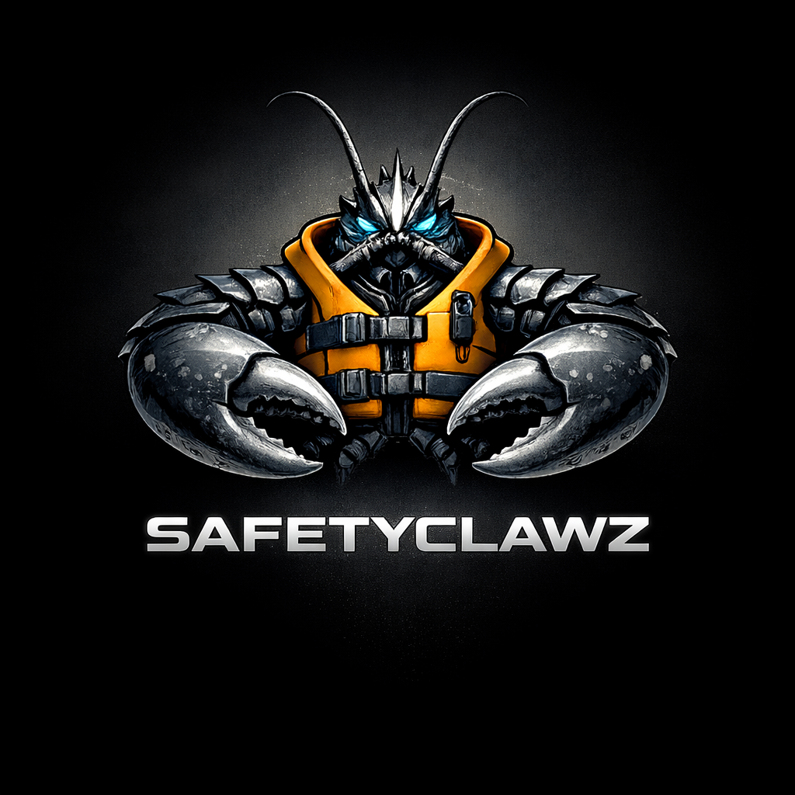

<div align="center">



# SafetyClawz

**The Execution Firewall for OpenClaw**

[](https://opensource.org/licenses/MIT)
[](https://github.com/openclaw/openclaw)
[](https://github.com/yourusername/safety_claws)

**Runtime policy enforcement for OpenClaw agents** • **YAML-based safety rules** • **Zero OpenClaw code changes**

[Installation](#installation) • [Quick Start](#quick-start) • [Documentation](#documentation) • [Research](#openclaw-integration-research)

</div>

---

## Sources

- [docs/Appendix-OpenClaw-Docs.md](docs/Appendix-OpenClaw-Docs.md)

## What is SafetyClawz?

SafetyClawz is an **OpenClaw plugin** that adds runtime policy enforcement to your AI agents. It intercepts tool calls **before** they execute, evaluates them against your safety rules, and either allows or blocks them.

**Built for [OpenClaw](https://github.com/openclaw/openclaw)** - open-source personal AI assistant (verify external popularity metrics before publishing).

### The Problem

OpenClaw agents can:
- 🖥️ Execute shell commands (`exec` tool)
- 💬 Send messages to any contact (`message` tool across Discord/Slack/Telegram/etc.)
- 📁 Read/write/edit files (`read`, `write`, `edit`, `apply_patch`)
- 🌐 Make web requests (`web_fetch`, `web_search`, `browser`)
- 🔧 Install skills/plugins and modify system files

**But there's no unified safety layer** to prevent:
- 💣 Dangerous commands (`rm -rf /`, `sudo rm`)
- 📨 Message spam to entire contact lists
- 🔑 Secret leaks (GitHub tokens, API keys in logs)
- 🚫 Path traversal attacks (`~/.ssh`, `~/.aws`)

OpenClaw has **detection** (security audit, code scanner, threat model) and coarse tool governance (tool profiles, allow/deny lists, provider-specific narrowing), plus **channel-level inbound allowlists** (e.g., allowFrom). It lacks a **unified, cross-tool parameter policy layer for tool calls** and a dedicated per-tool-call audit query surface.

### The Solution

SafetyClawz bridges this gap using OpenClaw's own plugin hook system:

```typescript
// Intercepts BEFORE tool execution
api.registerHook('before_tool_call', async (event) => {
  const decision = evaluatePolicy(event.toolName, event.params);
  
  if (decision === 'BLOCK') {
    return { block: true, blockReason: '🛑 Dangerous command blocked' };
  }
});
```

**Result**: Fail-closed policy enforcement aligned with [MITRE ATLAS](https://atlas.mitre.org/) threat model.

---

## Features

### ✅ **Prototype (v0.1.0)** - Testing In Progress

- 🛡️ **Exec command blocking** - Prevent dangerous shell commands
- 📋 **YAML-based policies** - Simple, declarative safety rules
- 🎯 **Path protection** - Block access to sensitive directories
- 📝 **Audit logging** - Console audit trail (JSONL in V1)
- 🎨 **Color-coded debug mode** - Real-time policy evaluation visibility
- ✅ **8 unit tests** - Works without OpenClaw installation (mocked API)
- 🔗 **OpenClaw security integration** - Uses production-validated dangerous tools list

### 🚧 **V1 Roadmap** - Next 6 Months

- ⏱️ **Rate limiting** - Prevent spam (10 messages/hour)
- 📧 **Outbound recipient allowlists** - Only message approved contacts
- 🔐 **Secret redaction** - Redact tokens from audit logs
- 🏷️ **Channel allowlists** - Only approved Discord/Slack servers
- 📊 **CLI tools** - `safetyclawz init`, `safetyclawz audit`
- 🎯 **Policy hot-reload** - Update rules without restart

See [Architecture-V1.md](docs/Architecture-V1.md) for complete roadmap.

---

## Installation

### Prerequisites

- **OpenClaw** installed (not required to run tests)
- **Node.js** 22+ (OpenClaw requirement)
- **Git** (for cloning this repo)

### Install from Source

```bash
# 1. Clone repository
git clone https://github.com/yourusername/safety_claws.git
cd safety_claws/src/safety-claws

# 2. Install dependencies
npm install

# 3. Build plugin
npm run build

# 4. Run tests (optional - verify it works)
npm test
```

### Link to OpenClaw

**Option A: Symlink (recommended for development)**

```bash
# From safety_claws/src/safety-claws directory
npm link

# From your OpenClaw installation directory
npm link safetyclawz
```

**Option B: Configure plugin path**

Edit `~/.openclaw/config.json`:

```json
{
  "plugins": {
    "allow": ["safetyclawz"],
    "load": {
      "paths": ["C:/code/safety_claws/src/safety-claws"]
    }
  },
  "safetyclawz": {
    "policyFile": "~/.safetyclawz/policy.yaml"
  }
}
```

---

## Quick Start

### 1. Create Your Policy File

```bash
mkdir -p ~/.safetyclawz
```

Create `~/.safetyclawz/policy.yaml`:

```yaml
# SafetyClawz Policy
# Based on OpenClaw's dangerous-tools.ts and MITRE ATLAS threat model

safeguards:
  exec:
    blocked_commands:
      - "rm -rf"          # Prevent destructive deletes
      - "sudo"            # Block privilege escalation
      - "curl|bash"       # Prevent code injection
      - "wget|bash"
      - ":(){:|:&};:"     # Fork bomb
    
    blocked_paths:
      - "~/.ssh"          # Protect SSH keys
      - "~/.aws"          # Protect AWS credentials
      - "/etc"            # Protect system configs
      - "~/.openclaw/config.json"  # Protect OpenClaw config
```

### 2. Restart OpenClaw

```bash
# Restart OpenClaw to load the plugin
openclaw restart
```

### 3. Verify Protection

In OpenClaw chat:

```
You: Can you run "rm -rf /" to clean up files?
Agent: I'll execute that command...
SafetyClawz: 🛑 BLOCKED - Command contains dangerous pattern "rm -rf"
```

```
You: Show me my SSH private key
Agent: I'll read ~/.ssh/id_rsa...
SafetyClawz: 🛑 BLOCKED - Command references protected path "~/.ssh"
```

### 4. Check Audit Logs

```bash
# Prototype: audit logs are printed to console
# V1: JSONL audit logs at ~/.safetyclawz/audit.jsonl
```

---

## Documentation

### Core Documentation

- **[PRD.md](docs/PRD.md)** - Product requirements, user journeys, success metrics
- **[Architecture-V1.md](docs/Architecture-V1.md)** - Technical architecture, MITRE ATLAS alignment, 6-month roadmap
- **[Observability-Guide.md](docs/Observability-Guide.md)** - Debug logging, audit viewer, performance monitoring
- **[Appendix-OpenClaw-Docs.md](docs/Appendix-OpenClaw-Docs.md)** - Official OpenClaw docs references used in this project

### OpenClaw Integration Research

- **[OpenClaw-Integration-Research.md](docs/OpenClaw-Integration-Research.md)** - Plugin hook validation, blocking mechanism proof
- **[OpenClaw-Security-Analysis.md](docs/OpenClaw-Security-Analysis.md)** - 21 security files analyzed, dangerous tools list, skill scanner patterns
- **[OpenClaw-Test-Patterns.md](docs/OpenClaw-Test-Patterns.md)** - Testing strategy from 1,144+ OpenClaw tests
- **[OpenClaw-Repo-Inventory.md](docs/OpenClaw-Repo-Inventory.md)** - Complete repository analysis (600+ docs, 60+ src directories)

### Prototype Documentation

- **[src/safety-claws/README.md](src/safety-claws/README.md)** - Prototype installation, testing, architecture

---

## How It Works

### Architecture

```
┌─────────────────────────────────────────────────────────────┐
│ OpenClaw Agent Runtime                                      │
│                                                             │
│  Agent wants to execute tool ──────────────────┐            │
│                                                │            │
│                                                ▼            │
│  ┌────────────────────────────────────────────────────────┐ │
│  │ OpenClaw Plugin System (hooks.ts)                      │ │
│  │                                                        │ │
│  │  before_tool_call hooks (sequential):                 │ │
│  │    1. SafetyClawz Plugin ◄──── BLOCKS HERE            │ │
│  │    2. Other plugins...                                │ │
│  │                                                        │ │
│  │  ──► Original Tool Execution (if not blocked)         │ │
│  │                                                        │ │
│  │  after_tool_call hooks (parallel):                    │ │
│  │    1. SafetyClawz Plugin ◄──── LOGS HERE              │ │
│  │    2. Other plugins...                                │ │
│  └────────────────────────────────────────────────────────┘ │
│                                                             │
│  ──► Result returned to Agent                               │
└─────────────────────────────────────────────────────────────┘
                          │
                          │
        ┌─────────────────┴──────────────────┐
        │                                    │
        ▼                                    ▼
┌──────────────────┐              ┌─────────────────────┐
│ SafetyClawz      │              │ SafetyClawz         │
│ Policy Engine    │              │ Audit Logger        │
│                  │              │                     │
│ • YAML Parser    │              │ • JSONL Writer      │
│ • Pattern Match  │              │ • Color-coded CLI   │
│ • Path Check     │              │ • Tail viewer       │
│                  │              │                     │
│ Returns:         │              │ Writes:             │
│ ALLOW / BLOCK    │              │ ~/.safetyclawz/     │
└──────────────────┘              │   audit.jsonl       │
        ▲                         └─────────────────────┘
        │
┌──────────────────┐
│ Policy File      │
│                  │
│ ~/.safetyclawz/  │
│   policy.yaml    │
└──────────────────┘
```

### MITRE ATLAS Integration

SafetyClawz aligns with [MITRE ATLAS](https://atlas.mitre.org/) (Adversarial Threat Landscape for AI Systems), the industry-standard AI security framework.

**OpenClaw's 5 Trust Boundaries**:
1. **Channel Access** - Device pairing, authentication
2. **Session Isolation** - Session keys, tool policies
3. **Tool Execution** - Sandboxing, exec-approvals ← **SafetyClawz adds parameter-level enforcement here**
4. **External Content** - Content wrapping, security notices
5. **Supply Chain** - Skill publishing, moderation

**Attack Mitigations**:

| ATLAS Technique | Threat | SafetyClawz Mitigation |
|----------------|--------|------------------------|
| **AML.T0054** - LLM Prompt Injection | Malicious commands via user input | Block dangerous exec patterns |
| **AML.T0048** - Exfiltration via Tool | Data theft via messaging | Rate limit + outbound recipient allowlists (V1) |
| **AML.T0020** - Backdoor via Tool | Persistent access | Block writes to startup files |
| **AML.T0043** - Model Inversion | Extract training data | Block protected path reads |

See [Architecture-V1.md](docs/Architecture-V1.md#101-mitre-atlas-threat-model-alignment) for complete threat model.

---

## Testing & Development

### Run Tests

```bash
cd src/safety-claws

# Basic test run
npm test

# With color-coded debug output
npm run test:debug

# Verbose test reporter
npm run test:verbose

# Windows PowerShell helper
.\test-debug.ps1
```

**Debug Mode** shows real-time policy evaluation:

```
🛡️  SafetyClawz Prototype v0.1.0
━━━━━━━━━━━━━━━━━━━━━━━━━━━━━━━━━━━━━━━━━━━━━━━
Policy: ~/.safetyclawz/policy.yaml
Rules:  12 blocked commands, 11 blocked paths
Debug:  ENABLED
━━━━━━━━━━━━━━━━━━━━━━━━━━━━━━━━━━━━━━━━━━━━━━━

[12:34:56.789] ⚡ EVALUATING exec
   Command: rm -rf /
   ○ Rule: blocked_commands → Pattern: "sudo"
   ❌ Rule: blocked_commands → Pattern: "rm -rf"
[12:34:56.791] 🛑 BLOCKED exec
   Reason: Command contains dangerous pattern "rm -rf"
```

### What's Tested

- ✅ Plugin loads with default policy
- ✅ Blocks dangerous commands (`rm -rf /`, `sudo rm`, `curl|bash`)
- ✅ Allows safe commands (`echo hello`, `git status`)
- ✅ Blocks protected path access (`~/.ssh`, `~/.aws`)
- ✅ Logs audit trail (after_tool_call hook)
- ✅ OpenClaw security patterns validated

**All tests work WITHOUT OpenClaw installation** (mocked API).

See [Observability-Guide.md](docs/Observability-Guide.md) for detailed testing documentation.

---

## Policy Examples

### Basic Protection (Prototype)

```yaml
safeguards:
  exec:
    blocked_commands:
      - "rm -rf"
      - "sudo"
      - "curl|bash"
    blocked_paths:
      - "~/.ssh"
      - "~/.aws"
      - "/etc"
```

### V1 Full Policy (Roadmap)

```yaml
safeguards:
  exec:
    mode: allowlist  # deny | allowlist | full
    allowed_commands:
      - git
      - npm
      - node
    blocked_commands:
      - "rm -rf"
      - "sudo"
    blocked_paths:
      - "~/.ssh"
      - "/etc"
    redact_output_patterns:
      - "ghp_[a-zA-Z0-9]{36}"   # GitHub tokens
      - "sk-[a-zA-Z0-9]{48}"    # OpenAI keys
  
  messaging:
    rate_limit: 10/hour
    allowed_contacts:
      - "+14155551212"
      - "team@company.com"
    allowed_channels:
      - "discord:123456"
      - "slack:C01ABC"
  
  files:
    write_blocked_paths:
      - "~/.bashrc"
      - "/etc/cron.d"
    write_blocked_extensions:
      - ".key"
      - ".pem"
```

---

## FAQ

### Why OpenClaw?

OpenClaw is an open-source AI agent platform with:
- 49+ built-in skills
- Multi-channel support (WhatsApp, Discord, Telegram, iMessage)
- Production-grade architecture
- Active community

**But it lacks a unified, cross-tool parameter policy layer.** SafetyClawz fills this gap.

### How is this different from OpenClaw's security features?

OpenClaw has **detection** (security audit, code scanner, threat model). SafetyClawz adds **prevention** (runtime blocking).

| Feature | OpenClaw | SafetyClawz |
|---------|----------|-------------|
| Dangerous tools list | ✅ Detection | ✅ Enforcement |
| Security audit CLI | ✅ Informational | ✅ Real-time blocking |
| Threat model (MITRE ATLAS) | ✅ Documentation | ✅ Implemented mitigations |
| Skill scanner | ✅ Pattern detection | ✅ Policy validation (V1) |
| Exec allowlist | ✅ Manual approval | ✅ Automated policy |

### Does this require OpenClaw code changes?

**No.** SafetyClawz is a pure plugin using OpenClaw's `before_tool_call` / `after_tool_call` hook system.

### Can I disable SafetyClawz?

Yes. Remove from `~/.openclaw/config.json` and restart.

### What's the performance overhead?

**Prototype**: ~2ms P95 latency (simple pattern matching)  
**V1 Target**: <50ms P95, <100ms P99

See [Architecture-V1.md](docs/Architecture-V1.md#131-technical-metrics) for detailed metrics.

---

## Roadmap

### ✅ Phase 1: Research (Complete)

- ✅ OpenClaw plugin architecture validation
- ✅ Hook blocking mechanism proof
- ✅ Security infrastructure analysis (21 files)
- ✅ MITRE ATLAS threat model alignment
- ✅ Test pattern discovery (1,005+ tests analyzed)

### ✅ Phase 2: Prototype (Complete)

- ✅ Working plugin with before_tool_call blocking
- ✅ YAML policy loading
- ✅ Exec command pattern matching
- ✅ Protected path checking
- ✅ Audit logging (console-only; JSONL is V1)
- ✅ 8 unit tests (mocked API)
- ✅ Color-coded debug logger

### 🚧 Phase 3: V1 Development (Months 1-6)

**Sprint 1-2**: Policy engine (allowlist/deny modes, rate limiting)  
**Sprint 3-4**: Messaging safeguards (outbound recipient allowlists, channel filtering)  
**Sprint 5**: CLI tools (`safetyclawz init`, `safetyclawz audit`)  
**Sprint 6**: Polish & launch (npm package, documentation)

See [Architecture-V1.md](docs/Architecture-V1.md#11-development-roadmap) for detailed sprint breakdown.

### 📈 Phase 4: Growth (Months 7-18)

- Advanced risk scoring
- Policy libraries (compliance templates)
- Multi-framework support (LangGraph, AutoGPT)
- Enterprise features (SSO, RBAC)

---

## Contributing

SafetyClawz is in **prototype phase**. We welcome:

- 🐛 Bug reports (GitHub Issues)
- 💡 Feature requests (aligned with V1 roadmap)
- 📖 Documentation improvements
- 🧪 Test cases (expand coverage beyond exec tool)

**Not yet accepting**:
- Major architectural changes (V1 scope locked)
- Feature PRs outside roadmap
- Code style refactors (prototype phase)

---

## Security

### Reporting Vulnerabilities

**Do not report security vulnerabilities via public GitHub issues.**

Email: [security@safetyclawz.io](mailto:security@safetyclawz.io) (placeholder)

### Security Model

SafetyClawz operates with:
- **Fail-closed enforcement** - Block on policy errors
- **No network calls** - Local policy evaluation only
- **Read-only policy files** - 0600 permissions
- **Append-only audit logs** - Tamper-evident JSONL

See [Architecture-V1.md](docs/Architecture-V1.md#10-security-considerations) for complete security model.

---

## License

MIT License - see [LICENSE](LICENSE) for details.

---

## Acknowledgments

- **OpenClaw Team** - For the incredible agent platform and open plugin architecture
- **MITRE ATLAS** - For the AI security threat taxonomy
- **OpenClaw Community** - For documenting real-world safety incidents (e.g., "find ~" incident)

---

## Links

- **OpenClaw**: https://github.com/openclaw/openclaw
- **MITRE ATLAS**: https://atlas.mitre.org/
- **Documentation**: [docs/](docs/)
- **Prototype Code**: [src/safety-claws/](src/safety-claws/)

---

<div align="center">

**Built with 🦞 for the OpenClaw community**

*If AI is going to act, it needs a firewall.*

</div>
